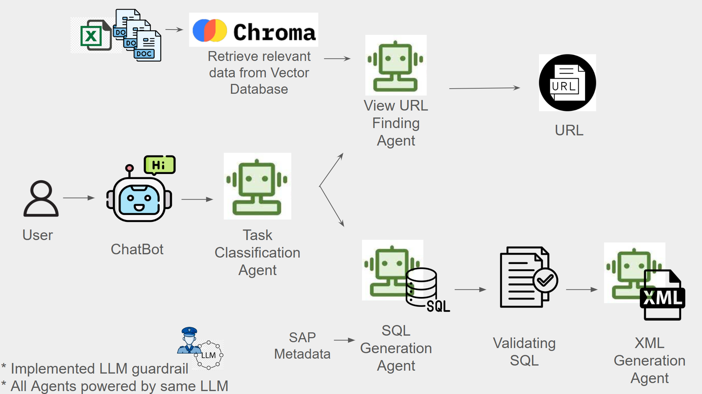

# Jivs-WEF-Hackathon
Navigating complex [JiVS Information Management Platform](https://jivs.com/products/#imp) can be overwhelming for beginners. Furthermore, creating Business Objects can be challenging for non-technical users, as it demands a thorough understanding of technical, business, and SQL-related concepts, in addition to being a time-consuming process.

To solve this we provide a single point solution which solves both the problem of 
- Navigating complex JiVS Information Management Platform
- Automating Business Object creation

This solution solves the problem with the help of chatbot - ZENIX (Zero Effort Natural language Integrated XML)

## Implementation Architecture:

<p align="center">
  
</p>
<p align="center">
    <b>Schema Mapping Approach 1</b> 
</p>

When a user queries the chatbot or ZENIX the query is classified as TASK1 (helping in navigating the JIVS IMP) or TASK2 (helping in creating the business objects) by the Task classification agent. 
- Scenario 1 (TASK1):
  If user enters the description of the required view in the chatbot, the user query is classified as Task 1. The finding URL agent go through the documents and retrieves the required URL based on the user description.

- Scenario 2 (TASK2):
  If the user queries the chatbot on SQL query the query is classified as Task 2. The SQL Agent takes over the task and helps in creating the SQL query. The job of the SQL agent is not done until a syntatically valid SQL is created. Once a valid SQL is created the task is handed over to the XML Generateion Agent. The XML Generation Agent creates the XML or the business object and saves in the created file.

## Application
[](https://youtu.be/T-D1KVIuvjA)

## Installation and Setup

- Create an environment and activate it
- Use the below command to install the required packages
```
pip install -r requirements.txt
pip install python-dotenv
```
- Setup chromadb
- To run the streamlit application code use the below command
```
streamlit run app.py
```

## Python Files

1. `app.py` is the python file used to having the streamlit code to run the chatbot
2. `utils.py` file has some supporting functions for the task.
3. `agents.py` file mentions the functionality of each agent
